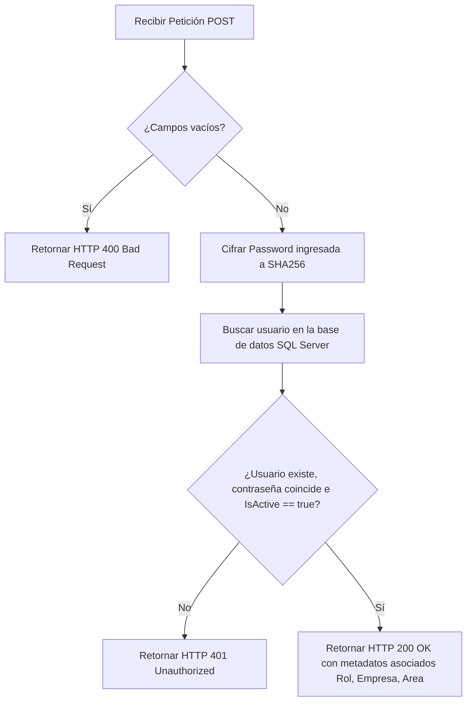

# Documentación de la API de Login: QualityDoc (DocNet)

Esta documentación describe técnicamente el endpoint de la API REST para la autenticación de usuarios. Está diseñado para ser consumido por aplicaciones móviles, frontend de terceros o integraciones externas.

---

## 1. Especificación General del Endpoint

* **Ruta de Acceso:** `/api/auth/login`
* **Método HTTP:** `POST`
* **Content-Type:** `application/json`

---

## 2. Parámetros de Entrada (Request Body)

La API recibe un objeto JSON en el cuerpo de la petición con las credenciales básicas del usuario.

### Estructura JSON:
```json
{
  "Email": "operador@gmail.com",
  "Password": "contraseña_segura"
}
```

### Detalle de Campos:
| Campo | Tipo | Requerido | Descripción |
| :--- | :--- | :--- | :--- |
| **Email** | String | Sí | Correo electrónico del usuario (no sensible a mayúsculas/minúsculas). |
| **Password** | String | Sí | Contraseña en texto plano para verificar contra la base de datos. |

---

## 3. Respuestas de la API (Responses)

### A. Autenticación Exitosa (HTTP 200 OK)
Devuelve un objeto JSON con los metadatos completos de la sesión del usuario.

#### Respuesta de ejemplo:
```json
{
  "id": 12,
  "nombre": "Usuario Operador",
  "usuario": "operador@gmail.com",
  "empresa": "Empresa Matriz SA de CV",
  "rol": "Operator",
  "departamento": "Calidad"
}
```

### B. Datos Faltantes (HTTP 400 Bad Request)
Ocurre si alguno de los campos requeridos (`Email` o `Password`) no se envía o está vacío.

#### Respuesta de ejemplo:
```json
{
  "message": "Email y contraseña son requeridos."
}
```

### C. Credenciales Incorrectas o Cuenta Inactiva (HTTP 401 Unauthorized)
Se presenta si el correo o la contraseña no coinciden con los registros, o si la cuenta de usuario está inhabilitada administrativamente (`IsActive = false`).

#### Respuesta de ejemplo:
```json
{
  "message": "Credenciales incorrectas o usuario inactivo."
}
```

---

## 4. Lógica de Implementación (Flujo del Código)

La lógica de backend está contenida en el controlador [AuthController.cs](file:///c:/Users/jenni/quality/QualityDocNet/QualityDoc/Controllers/AuthController.cs) y sigue estos pasos lógicos:



### Fragmento de Código Principal:
```csharp
[HttpPost("login")]
public async Task<IActionResult> Login([FromBody] LoginRequest request)
{
    if (request == null || string.IsNullOrEmpty(request.Email) || string.IsNullOrEmpty(request.Password))
    {
        return BadRequest(new { message = "Email y contraseña son requeridos." });
    }

    // 1. Cifra la contraseña para comparación segura
    var hash = PasswordHelper.HashPassword(request.Password);

    // 2. Busca al usuario activo en la BD cargando sus relaciones
    var usuario = await _context.Users
        .Include(u => u.Rol)
        .Include(u => u.Company)
        .Include(u => u.Department)
        .FirstOrDefaultAsync(u => u.Email == request.Email.ToLower() && u.PasswordHash == hash && u.IsActive);

    if (usuario == null)
    {
        return Unauthorized(new { message = "Credenciales incorrectas o usuario inactivo." });
    }

    // 3. Retorna la información formateada
    return Ok(new
    {
        id = usuario.Id,
        nombre = usuario.FullName,
        usuario = usuario.Email,
        empresa = usuario.Company?.Name ?? "Sin Empresa",
        rol = usuario.Rol?.Name ?? "Sin Rol",
        departamento = usuario.Department?.Name ?? "No Asignado" 
    });
}
```

---

## 5. Ejemplo de Prueba Rápida (cURL)

Puedes probar esta API directamente desde tu consola o terminal usando `cURL`:

```bash
curl -X POST http://localhost:5000/api/auth/login \
     -H "Content-Type: application/json" \
     -d "{\"Email\":\"operador@gmail.com\", \"Password\":\"123456\"}"
```
